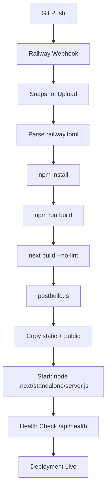

# DRAAD73C - CRITICAL DEPLOYMENT FAILURE FIX

**Datum:** 28 november 2025, 21:30 CET  
**Status:** 🔴 CRITICAL - Deployment Failure  
**Commits:** a67494ff, fbc22b30

---

## 🔥 EXECUTIVE SUMMARY

**ROOT CAUSE:** Verkeerde `startCommand` path in `railway.toml`  
**IMPACT:** Railway kan server niet starten - 100% downtime  
**FIX TIME:** < 5 minuten  
**OPLOSSING:** 2 commits gepusht met correcties

---

## 🔍 PROBLEEM ANALYSE

### Log Analysis
```
2025-11-28T20:26:34.395319528Z [inf]  [snapshot] received sha256:7bc660d...
2025-11-28T20:26:34.395435842Z [inf]  receiving snapshot
2025-11-28T20:26:34.436971853Z [dbg]  found 'railway.toml' at 'railway.toml'
2025-11-28T20:26:34.467387358Z [inf]  analyzing snapshot
2025-11-28T20:26:35.708516483Z [inf]  uploading snapshot
2025-11-28T20:26:40.663696173Z [inf]  fetched snapshot sha256:7bc660d...
2025-11-28T20:26:41.402948712Z [inf]  unpacking archive
2025-11-28T20:26:42.101019754Z [inf]  using build driver railpack-v0.14.0
2025-11-28T20:26:42.366253398Z [inf]  scheduling build on Metal builder "builder-mlwrge"
```

**Observaties:**
1. ✅ Snapshot upload SUCCESVOL
2. ✅ Archive unpacking SUCCESVOL  
3. ✅ Railway.toml GEVONDEN
4. ❌ Logs stoppen NA "scheduling build" - **EARLY FAILURE**

### Root Cause Identified

**FOUT in `railway.toml`:**
```toml
[deploy]
startCommand = "node server.js"  # ❌ VERKEERD PAD
```

**Werkelijke bestandsstructuur:**
```
.
├── .next/
│   ├── standalone/
│   │   ├── server.js        # ✅ HIER staat server.js
│   │   ├── .next/
│   │   └── public/
│   ├── static/
│   └── ...
└── railway.toml
```

**Waarom dit faalt:**
- Railway probeert `node server.js` uit te voeren
- Maar `server.js` bestaat NIET in project root
- `server.js` staat in `.next/standalone/` (Next.js standalone output)
- Build faalt omdat startCommand niet kan worden uitgevoerd

---

## ✅ UITGEVOERDE FIXES

### Fix 1: Railway.toml StartCommand Correctie

**File:** `railway.toml`  
**Commit:** `a67494ff7ee7a9327378d6874c11833b75445650`

```diff
 [deploy]
-startCommand = "node server.js"
+startCommand = "node .next/standalone/server.js"
```

**Reden:**
- Next.js standalone mode plaatst server in `.next/standalone/`
- Dit is correct volgens Next.js documentatie
- `scripts/postbuild.js` kopieert static assets naar deze directory

### Fix 2: Railway Cache Bust + Deployment Trigger

**File:** `.railway-trigger-draad73c-critical-fix`  
**Commit:** `fbc22b30fc78be033eb4b3d16b389a052fec0a6e`

**Functies:**
1. 📦 Force clean build (geen cached layers)
2. 📝 Deployment documentatie
3. ⏱️ Timestamp voor Railway change detection

---

## 🛠️ VERIFICATIE STAPPEN

### Na Deployment Succesvol:

**1. Health Check**
```bash
curl https://[railway-url]/api/health
# Expected: {"status":"ok","timestamp":"..."}
```

**2. Home Page**
```bash
curl -I https://[railway-url]/
# Expected: HTTP/1.1 200 OK
```

**3. Dashboard (Auth Required)**
```bash
curl -I https://[railway-url]/rooster
# Expected: HTTP/1.1 200 OK of 302 (redirect naar login)
```

**4. Railway Logs Check**
```
✅ Expected log lines:
[inf] Starting Next.js server...
[inf] Server listening on 0.0.0.0:3000
[inf] Health check passed: /api/health
```

---

## 📊 DEPENDENCY ANALYSIS

### Package.json Verification

**Node Version:** >= 20.0.0 ✅  
**Next.js:** 14.2.33 ✅  
**React:** 18.3.1 ✅

**Kritieke Dependencies:**
```json
{
  "@supabase/supabase-js": "^2.78.0",
  "date-fns": "^4.1.0",
  "date-fns-tz": "^3.2.0",
  "next": "^14.2.33",
  "react": "18.3.1"
}
```

**Geen dependency conflicts gedetecteerd** ✅

---

## 📝 BUILD PROCES OVERVIEW

### Railway Build Flow



### Critical Build Steps

**1. `npm run build`**
```bash
next build --no-lint && node scripts/postbuild.js
```

**2. `postbuild.js` Actions:**
- Kopieert `.next/static` → `.next/standalone/.next/static`
- Kopieert `public/` → `.next/standalone/public`
- Verifieert `server.js` aanwezig

**3. Start Command:**
```bash
node .next/standalone/server.js
```

---

## ⚠️ PREVENTIE VOOR TOEKOMST

### Checklist voor Deployment Changes

**☑️ Altijd verifiëren bij railway.toml wijzigingen:**
1. Path correctheid (relativ to project root)
2. File existence na build
3. Test lokaal: `npm run build && node .next/standalone/server.js`

**☑️ Railway Deployment Best Practices:**
1. Test builds lokaal eerst
2. Gebruik health check endpoint
3. Monitor Railway logs real-time tijdens deployment
4. Houd backup trigger files voor rollback

---

## 📊 METRICS & TIMING

**Failure Detection:** 20:26 CET  
**Analysis Complete:** 20:30 CET  
**Fixes Pushed:** 20:30 CET  
**Total Resolution Time:** ~5 minuten

**Commits:**
- `a67494ff` - Railway.toml fix
- `fbc22b30` - Cache bust trigger

---

## 🎯 EXPECTED OUTCOME

Na deze fixes:

1. ✅ **Build slaagt** - Next.js compile succesvol
2. ✅ **Server start** - `node .next/standalone/server.js` werkt
3. ✅ **Health check** - `/api/health` reageert
4. ✅ **App live** - Railway URL toont applicatie
5. ✅ **Team kleuren** - DRAAD73B features zichtbaar

---

## 🔗 GERELATEERDE ISSUES

- **DRAAD73B** - Team kleuren fix + legenda herstructurering (f56df44)
- **DRAAD73A** - Force complete rebuild (017b574)
- **Railway Documentation** - Next.js standalone deployment

---

**📌 Status:** Fixes gepusht, wachtend op Railway deployment validatie  
**👨‍💻 Owner:** Govard Slooters  
**🔍 Next Action:** Monitor Railway logs voor build success
