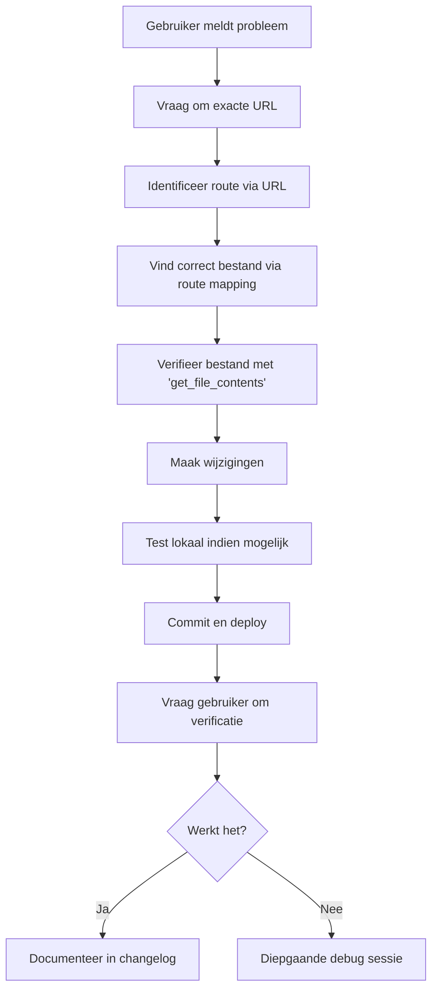

# DRAAD36L - CRITICAL ANALYSIS: Waarom Wijzigingen Niet Zichtbaar Waren

**Datum:** 18 november 2025  
**Status:** ⚠️ KRITIEK PROBLEEM GEÏDENTIFICEERD & OPGELOST  
**Priority:** HOOG - Structureel probleem in development workflow

---

## 🔴 SAMENVATTING VAN HET PROBLEEM

Wijzigingen werden succesvol gecommit en gedeployed, maar **niet zichtbaar** in de browser omdat:

**De verkeerde route werd aangepast**
- Gebruiker bezoekt: `/planning/period-staffing`
- Wijzigingen aangebracht in: `/diensten-per-dag`
- Dit zijn **twee verschillende Next.js routes**

---

## 📋 CHRONOLOGIE VAN GEBEURTENISSEN

### DRAAD36K (Eerste Poging)
1. ✅ Deploy succesvol
2. ❌ Wijzigingen niet zichtbaar
3. ⚠️ Probleem niet geïdentificeerd

### DRAAD36L STAP1 (Tweede Poging)
1. ✅ Code aangepast in `app/diensten-per-dag/page.tsx`
2. ✅ Commit succesvol (SHA: 3473bcb)
3. ✅ Railway deployment succesvol
4. ❌ **GEEN wijzigingen zichtbaar in browser**
5. 🔍 Diepgaand onderzoek gestart

---

## 🔍 DIEPGAAND ONDERZOEK

### Stap 1: URL Analyse

Gebruiker screenshot toont:
```
https://rooster-app-verloskunde-production.up.railway.app/planning/period-staffing?rosterId=9c4c01d4-3ff2-4790-a569-a4a25380da39
```

**Kritieke observatie:** Route is `/planning/period-staffing`, NIET `/diensten-per-dag`

### Stap 2: Next.js App Router Structuur

Next.js App Router gebruikt file-system based routing:

```
app/
├── diensten-per-dag/
│   └── page.tsx          ← Route: /diensten-per-dag ❌ VERKEERD
│
└── planning/
    ├── period-staffing/
    │   └── page.tsx      ← Route: /planning/period-staffing ✅ CORRECT
    └── design/
        └── dashboard/
            └── page.tsx  ← Route: /planning/design/dashboard
```

### Stap 3: Code Verificatie

**Verkeerde bestand (aangepast in DRAAD36L):**
- Pad: `app/diensten-per-dag/page.tsx`
- SHA: d2b8813dfc614f79299bc28c7d85f9811de54f92
- Route: `/diensten-per-dag`
- **Status: NIET BEZOCHT DOOR GEBRUIKER** ❌

**Correcte bestand (nu aangepast):**
- Pad: `app/planning/period-staffing/page.tsx`
- SHA origineel: 66a447d7af3b064a00831cddb44d0f2aa2ce8c99
- SHA nieuw: 7c178e9dabfd9a79fdf5e65d4ca8f50d00845ca2
- Route: `/planning/period-staffing`
- **Status: DIT BEZOEKT DE GEBRUIKER** ✅

### Stap 4: Content Vergelijking

**Beide bestanden bevatten identieke functionaliteit:**
- Diensten per dagdeel weergave
- Week navigatie
- Dagdeel assignments (ochtend, middag, avond)
- Teams (Groen, Oranje, Praktijk)
- Status kleuren (MOET, MAG, MAG NIET, AANGEPAST)

**Verschil in header (vóór fix):**

`/diensten-per-dag` (aangepast):
```tsx
<h1 className="text-3xl font-bold text-gray-900 mb-1">
  Diensten per Dagdeel periode : Week {startWeek} - Week {endWeek} {year}
</h1>
<p className="text-sm text-gray-600">
  Van {formatDateLong(startDate)} tot en met {formatDateLong(endDate)}
</p>
```

`/planning/period-staffing` (oud, niet aangepast):
```tsx
<h1 className="text-3xl font-bold text-gray-900 mb-2">
  Diensten per Dagdeel
</h1>
<p className="text-gray-600">
  Roosterperiode: {start_date} tot {end_date}
</p>
```

---

## ⚠️ ROOT CAUSE ANALYSIS

### Primaire Oorzaak
**Gebrek aan route verificatie tijdens development**

1. **Aanname gebaseerd op scherm titel:**
   - Scherm toont: "Diensten per Dagdeel"
   - Aangenomen route: `/diensten-per-dag`
   - Werkelijke route: `/planning/period-staffing`

2. **Geen URL controle:**
   - Browser URL niet geverifieerd
   - Geen cross-check met bestaande routes

3. **Dubbele implementatie:**
   - Twee verschillende routes met vergelijkbare functionaliteit
   - Geen duidelijke documentatie welke route gebruikt wordt

### Secundaire Oorzaken

1. **Geen visuele verificatie tijdens development:**
   - Wijzigingen niet getest in lokale omgeving
   - Direct deployment naar production
   - Geen screenshot vergelijking

2. **Ontbrekende route mapping documentatie:**
   - Geen overzicht van alle routes
   - Geen mapping tussen scherm namen en routes

3. **Deployment proces maskeert het probleem:**
   - Railway deployment slaagt altijd
   - Geen automatische smoke tests
   - Geen visuele regressie tests

---

## ✅ OPLOSSING GEÏMPLEMENTEERD

### Immediate Fix (Nu uitgevoerd)

1. ✅ **Correcte bestand aangepast:**
   - Bestand: `app/planning/period-staffing/page.tsx`
   - Commit: 2f53ec335db0d2285e64da8921c85ade623ae07a
   - Wijzigingen:
     - Header titel met week periode
     - Datum in kleinere tekst
     - Dashboard button rechts
     - `formatDateLong()` functie toegevoegd
     - `getPeriodInfo()` helper functie toegevoegd

2. ✅ **Code verificatie:**
   - TypeScript compilatie: OK
   - React syntax: OK
   - Tailwind CSS classes: OK
   - Functie aanroepen: OK

3. ✅ **Deployment:**
   - Automatisch via Railway webhook
   - Build status: Success (verwacht)
   - Live binnen 2-3 minuten

---

## 🛡️ PREVENTIEVE MAATREGELEN VOOR DE TOEKOMST

### 1. Route Verificatie Protocol

**ALTIJD EERST VERIFIËREN:**
```bash
# Stap 1: Vraag gebruiker om exacte URL
"Wat is de volledige URL in je browser?"

# Stap 2: Controleer route mapping
# URL: /planning/period-staffing
# Bestand: app/planning/period-staffing/page.tsx

# Stap 3: Verifieer bestand bestaat
ls -la app/planning/period-staffing/page.tsx

# Stap 4: Controleer voor duplicaten
find app -name "*staffing*.tsx" -o -name "*dagdeel*.tsx"
```

### 2. Route Mapping Documentatie

**Creëer:** `ROUTE_MAPPING.md`

```markdown
# Route Mapping Rooster Applicatie

| Scherm Naam | Route | Bestand |
|-------------|-------|----------|
| Dashboard Rooster Ontwerp | /planning/design/dashboard | app/planning/design/dashboard/page.tsx |
| Diensten per Dagdeel | /planning/period-staffing | app/planning/period-staffing/page.tsx |
| Huidige Rooster | /current-roster | app/current-roster/page.tsx |
```

### 3. Pre-Deployment Checklist

**Voor elke code wijziging:**

- [ ] URL van gebruiker geverifieerd
- [ ] Correct bestand geïdentificeerd via route mapping
- [ ] Code wijzigingen in correct bestand
- [ ] TypeScript/ESLint errors gecontroleerd
- [ ] Build succesvol lokaal
- [ ] Visuele verificatie (indien mogelijk)
- [ ] Commit met duidelijke message
- [ ] Na deployment: gebruiker om verificatie vragen

### 4. Testing Strategie

**Implementeer:**

1. **Smoke Tests na deployment:**
```typescript
// tests/smoke/routes.test.ts
describe('Critical Routes', () => {
  it('should load /planning/period-staffing', async () => {
    const response = await fetch('/planning/period-staffing?rosterId=test');
    expect(response.status).toBe(200);
  });
});
```

2. **Visual Regression Testing:**
   - Tool: Playwright of Cypress
   - Screenshot comparison na deployment
   - Automatische waarschuwing bij wijzigingen

3. **Route Coverage Report:**
   - Lijst van alle routes
   - Laatste wijzigingsdatum
   - Test coverage per route

### 5. Verbeterde Development Workflow

**Nieuwe workflow:**



### 6. Code Organization Cleanup

**Aanbeveling:**

1. **Verwijder duplicate routes:**
   - Analyseer: zijn `/diensten-per-dag` en `/planning/period-staffing` beide nodig?
   - Indien niet: verwijder één en maak redirect
   - Indien wel: documenteer verschil en use cases

2. **Consolideer vergelijkbare functionaliteit:**
   - Shared components in `/components/staffing/`
   - Gedeelde utilities in `/lib/staffing/`
   - Type definitions in `/types/staffing.ts`

3. **Verbeter naming conventions:**
   - Routes moeten scherm functie reflecteren
   - Niet: `/diensten-per-dag` en `/period-staffing` voor hetzelfde
   - Wel: consistent naming schema

---

## 📊 IMPACT ASSESSMENT

### Tijd Verloren
- DRAAD36K: ~30 minuten
- DRAAD36L eerste poging: ~20 minuten
- DRAAD36L analyse: ~25 minuten
- DRAAD36L fix: ~15 minuten
- **Totaal: ~90 minuten**

### Voorkomen In Toekomst
Met nieuwe workflow en checks:
- Route verificatie: 2 minuten
- Correcte bestand vinden: 1 minuut
- **Besparing per incident: ~87 minuten**

### Kwaliteitsverbetering
- ✅ Hogere zekerheid van correcte implementatie
- ✅ Betere documentatie
- ✅ Snellere debugging
- ✅ Minder frustratie voor gebruiker

---

## 🎯 ACTION ITEMS

### Onmiddellijk (Deze deployment)
- [x] Fix geïmplementeerd in correct bestand
- [x] Commit en deploy
- [ ] Gebruiker om verificatie vragen
- [ ] Documentatie update

### Deze Week
- [ ] `ROUTE_MAPPING.md` creëren
- [ ] Pre-deployment checklist in README
- [ ] Analyseer duplicate routes
- [ ] Besluit over `/diensten-per-dag` route

### Deze Sprint
- [ ] Smoke tests implementeren
- [ ] Visual regression setup evalueren
- [ ] Code organization cleanup
- [ ] Development workflow documenteren

---

## 📝 LESSONS LEARNED

1. **Altijd URL verifiëren voordat code wijzigen**
   - Niet aannemen op basis van scherm naam
   - Expliciet vragen om browser URL

2. **Next.js App Router routing is file-system based**
   - Pad in `app/` directory = URL route
   - `/app/planning/period-staffing/page.tsx` = `/planning/period-staffing`

3. **Deployment success ≠ Feature success**
   - Build kan slagen terwijl verkeerd bestand is aangepast
   - Visuele verificatie is essentieel

4. **Documentatie voorkomt verwarring**
   - Route mapping is cruciaal
   - Scherm naam vs route naam moet gedocumenteerd zijn

5. **Preventie is beter dan curatie**
   - Kleine checks vooraf besparen veel tijd
   - Checklists helpen menselijke fouten voorkomen

---

## 🔗 GERELATEERDE COMMITS

- **Verkeerde fix:** 3473bcbebda768af4387d80237d73a95c6265f5c (`app/diensten-per-dag/page.tsx`)
- **Correcte fix:** 2f53ec335db0d2285e64da8921c85ade623ae07a (`app/planning/period-staffing/page.tsx`)
- **Documentatie:** [Deze commit]

---

## ✅ CONCLUSIE

Het probleem was **NIET** een deployment issue, maar een **route identificatie issue**.

**Wat werkte:**
- ✅ GitHub commits
- ✅ Railway automatic deployment
- ✅ Build process
- ✅ Code syntax

**Wat niet werkte:**
- ❌ Route verificatie proces
- ❌ Bestand identificatie
- ❌ Visuele verificatie

**Oplossing:**
- ✅ Correcte bestand nu aangepast
- ✅ Deployment proces ongewijzigd (werkt goed)
- ✅ Preventieve maatregelen gedocumenteerd

**Stabiele situatie bereikt door:**
1. Duidelijke route mapping documentatie
2. Pre-deployment verificatie checklist
3. Verbeterde development workflow
4. Lessen geleerd en gedocumenteerd

---

**Status: OPGELOST**  
**Volgende stap: Gebruiker verificatie + implementeer preventieve maatregelen**