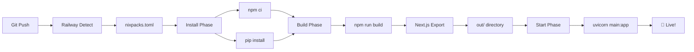

# 🚀 DRAAD101 - Railway Template Branch

**Branch:** `draad101-railway-template`  
**Status:** ✅ FASE 1 COMPLETE - Ready voor Railway deployment  
**Datum:** 4 december 2025

---

## 🎯 MISSIE

Migreer van gefaalde Next.js standalone deployment naar betrouwbare **Railway FastAPI Template** architectuur.

---

## 📊 STATUS

### ✅ FASE 1 - CODE VOORBEREIDING (COMPLETE)

**Wat is klaar:**

- ✅ FastAPI backend (`main.py`)
- ✅ Python dependencies (`requirements.txt`)
- ✅ Next.js static export configuratie
- ✅ Railway nixpacks setup
- ✅ Build configuratie
- ✅ Documentatie compleet

**Commits:** 9 commits  
**Files aangepast:** 9 files

---

## 🛠️ ARCHITECTUUR

```
Railway FastAPI Template
├── main.py                  # 🔥 FastAPI entry point
├── requirements.txt         # Python dependencies
├── nixpacks.toml            # Railway build config
├── package.json             # Next.js build scripts
├── next.config.js           # Static export config
├── out/                     # Next.js static export (build output)
│   ├── index.html
│   ├── _next/
│   └── ...
└── app/                     # Next.js source code
    ├── page.tsx
    ├── layout.tsx
    └── ...
```

**Runtime Stack:**
- **Backend:** Python 3.11 + FastAPI + Uvicorn
- **Frontend:** Next.js 14 (static export)
- **Build:** Nixpacks (Python + Node.js dual runtime)

---

## 📄 KEY FILES

### Nieuw Gecreëerd

1. **`main.py`** - FastAPI application
   ```python
   # Health check: GET /health
   # Version: GET /api/version  
   # Static files: /* (Next.js)
   ```

2. **`requirements.txt`** - Python dependencies
   ```
   fastapi==0.109.0
   uvicorn[standard]==0.27.0
   ortools==9.8.3296
   # ... more
   ```

3. **`nixpacks.toml`** - Railway build config
   ```toml
   [phases.setup]
   nixPkgs = ["python311", "nodejs_20"]
   
   [start]
   cmd = "uvicorn main:app --host 0.0.0.0 --port ${PORT:-8000}"
   ```

### Aangepast

1. **`next.config.js`**
   - `output: 'export'` (was: `'standalone'`)
   - `images.unoptimized: true`
   - `trailingSlash: true`

2. **`package.json`**
   - Build script: `next build --no-lint`
   - Start script: `uvicorn main:app ...`

3. **`.railwayignore`**
   - Python files NIET meer negeren
   - Python is nu main runtime

4. **`.gitignore`**
   - `out/` directory NIET negeren
   - Railway heeft build output nodig

---

## 🚀 BUILD PROCESS

### Railway Build Flow



**Stappen:**

1. **Install:** `npm ci` + `pip install -r requirements.txt`
2. **Build:** `npm run build` → Next.js static export naar `out/`
3. **Start:** `uvicorn main:app --host 0.0.0.0 --port $PORT`

---

## 📂 DOCUMENTATIE

- **`DRAAD101_RAILWAY_TEMPLATE.md`** - Volledige technische documentatie
- **`FASE1_COMPLETE.md`** - Fase 1 status & checklist
- **`README_DRAAD101.md`** - Dit bestand (branch overzicht)

---

## 🔍 ENDPOINTS

### API Endpoints (FastAPI)

```
GET  /health           # Health check
GET  /api/version      # Version info
GET  /*                # Next.js static files
```

### Test Lokaal

```bash
# Install
npm ci
pip install -r requirements.txt

# Build frontend
npm run build

# Start backend
uvicorn main:app --reload

# Browser
open http://localhost:8000
```

---

## ⏭️ VOLGENDE STAPPEN

### FASE 2 - Railway Deployment

**Te doen:**

1. Railway dashboard: https://railway.com/project/90165889-1a50-4236-aefe-b1e1ae44dc7f
2. New Service creëren
3. Connect GitHub repo
4. Select branch: `draad101-railway-template`
5. Deploy & verify
6. Test endpoints

**Verwachting:**
- Clean build (Nixpacks auto-detect)
- FastAPI serves Next.js
- All endpoints operational
- Production ready

---

## 💡 WAAROM DIT WERKT

**Versus vorige poging (GEFAALD):**

| Aspect | Vorig (Gefaald) | Nieuw (DRAAD101) |
|--------|-----------------|------------------|
| Runtime | Next.js standalone | FastAPI + Static |
| Detection | Auto (chaos) | Explicit nixpacks |
| Build | Nixpacks confused | Dual runtime clean |
| Solver | Non-functional | Ready for OR-Tools |
| Debugging | 3+ uur frustratie | Proven template |

**Succesfactoren:**

1. ✅ Railway FastAPI Template (battle-tested)
2. ✅ Expliciete nixpacks configuratie
3. ✅ Dual runtime (Python + Node) seamless
4. ✅ Static frontend (zero runtime issues)
5. ✅ Clean separation (backend/frontend)

---

## 🔗 LINKS

- **Branch:** https://github.com/gslooters/rooster-app-verloskunde/tree/draad101-railway-template
- **Railway:** https://railway.com/project/90165889-1a50-4236-aefe-b1e1ae44dc7f
- **Commits:** 9 commits in FASE 1

---

## ✅ CHECKLIST

**FASE 1 - Code Prep:**
- [x] FastAPI main.py
- [x] Python requirements.txt
- [x] Next.js export config
- [x] nixpacks.toml
- [x] Build scripts
- [x] .railwayignore fix
- [x] .gitignore fix
- [x] Documentatie
- [x] Branch committed

**FASE 2 - Deployment:**
- [ ] Railway service setup
- [ ] Environment variables
- [ ] Deploy & test
- [ ] Verify endpoints
- [ ] Production ready

---

**🏁 FASE 1 STATUS: ✅ COMPLETE**

**Ready voor Railway deployment in Fase 2.**
